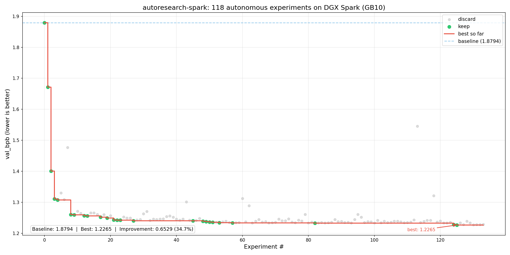

# autoresearch-spark

Fork of [karpathy/autoresearch](https://github.com/karpathy/autoresearch) adapted for the [NVIDIA DGX Spark](https://www.nvidia.com/en-us/products/workstations/dgx-spark/) (GB10 / Blackwell).



*118 experiments ran autonomously overnight on a DGX Spark. The agent reduced val_bpb from 1.8794 (baseline) to 1.2265 -- a 34.7% improvement -- by adapting hyperparameters to the GB10's constraints. See the [spark-appendix](../../tree/spark-appendix) branch for platform details, learnings, and OpenShell sandboxing integration.*

The idea: give an AI agent a small but real LLM training setup and let it experiment autonomously overnight. It modifies the code, trains for 5 minutes, checks if the result improved, keeps or discards, and repeats. You wake up in the morning to a log of experiments and (hopefully) a better model. The training code here is a simplified single-GPU implementation of [nanochat](https://github.com/karpathy/nanochat). The core idea is that you're not touching any of the Python files like you normally would as a researcher. Instead, you are programming the `program.md` Markdown files that provide context to the AI agents and set up your autonomous research org. The default `program.md` in this repo is intentionally kept as a bare bones baseline, though it's obvious how one would iterate on it over time to find the "research org code" that achieves the fastest research progress, how you'd add more agents to the mix, etc. A bit more context on this project is here in this [tweet](https://x.com/karpathy/status/2029701092347630069).

## How it works

The repo is deliberately kept small and only really has three files that matter:

- **`prepare.py`** — fixed constants, one-time data prep (downloads training data, trains a BPE tokenizer), and runtime utilities (dataloader, evaluation). Not modified.
- **`train.py`** — the single file the agent edits. Contains the full GPT model, optimizer (Muon + AdamW), and training loop. Everything is fair game: architecture, hyperparameters, optimizer, batch size, etc. **This file is edited and iterated on by the agent**.
- **`program.md`** — baseline instructions for one agent. Point your agent here and let it go. **This file is edited and iterated on by the human**.

By design, training runs for a **fixed 5-minute time budget** (wall clock, excluding startup/compilation), regardless of the details of your compute. The metric is **val_bpb** (validation bits per byte) — lower is better, and vocab-size-independent so architectural changes are fairly compared.

If you are new to neural networks, this ["Dummy's Guide"](https://x.com/hooeem/status/2030720614752039185) looks pretty good for a lot more context.

## Quick start

**Requirements:** A single NVIDIA GPU (tested on DGX Spark / GB10 and H100), Python 3.10+, [uv](https://docs.astral.sh/uv/).

```bash

# 1. Install uv project manager (if you don't already have it)
curl -LsSf https://astral.sh/uv/install.sh | sh

# 2. Install dependencies
uv sync

# 3. Download data and train tokenizer (one-time, ~2 min)
uv run prepare.py

# 4. Manually run a single training experiment (~5 min)
uv run train.py
```

If the above commands all work ok, your setup is working and you can go into autonomous research mode.

## Running the agent

Simply spin up your Claude/Codex or whatever you want in this repo (and disable all permissions), then you can prompt something like:

```
Hi have a look at program.md and let's kick off a new experiment! let's do the setup first.
```

The `program.md` file is essentially a super lightweight "skill".

## Project structure

```
prepare.py      — constants, data prep + runtime utilities (do not modify)
train.py        — model, optimizer, training loop (agent modifies this)
program.md      — agent instructions
pyproject.toml  — dependencies
```

## Design choices

- **Single file to modify.** The agent only touches `train.py`. This keeps the scope manageable and diffs reviewable.
- **Fixed time budget.** Training always runs for exactly 5 minutes, regardless of your specific platform. This means you can expect approx 12 experiments/hour and approx 100 experiments while you sleep. There are two upsides of this design decision. First, this makes experiments directly comparable regardless of what the agent changes (model size, batch size, architecture, etc). Second, this means that autoresearch will find the most optimal model for your platform in that time budget. The downside is that your runs (and results) become not comparable to other people running on other compute platforms.
- **Self-contained.** No external dependencies beyond PyTorch and a few small packages. No distributed training, no complex configs. One GPU, one file, one metric.

## Changes from upstream

- **SDPA instead of Flash Attention 3.** The GB10 (sm_121a) has no prebuilt FA3 kernels. SDPA via `F.scaled_dot_product_attention` is actually ~2% faster on this GPU anyway.
- **Triton ptxas fix.** Sets `TRITON_PTXAS_PATH` to the system CUDA 13.0 ptxas, which supports sm_121a for Triton kernel compilation.
- **GPU auto-detection for MFU.** Replaces the hardcoded `H100_BF16_PEAK_FLOPS` with a lookup table covering H100, H200, A100, B200, GB10, and AMD MI300X/MI250X.
- **NaN guard.** Aborts on NaN loss (the GB10's limited matmul precision occasionally produces NaNs during aggressive hyperparameter search).
- **Checkpoint save.** Saves `model.pt` at end of training for use with `generate.py` (on the spark-appendix branch).
- **Removed `kernels` dependency.** Not needed when using SDPA.
- **OpenShell sandbox.** `sandbox/` contains a Dockerfile and policies for running the agent in a locked-down container (see below).

## OpenShell sandboxing

The `sandbox/` directory provides integration with [OpenShell](https://github.com/NVIDIA/OpenShell) for running the autonomous agent in a sandboxed container. This has been tested on DGX Spark but could be adapted to other platforms. Prerequisite: [OpenShell](https://github.com/NVIDIA/OpenShell) installed on your Spark.

The image is built ahead of time with all dependencies pre-installed, so at runtime the agent gets a locked-down environment:

- **Filesystem:** read-only system paths, read-write only to `/sandbox` and `/tmp`
- **Network:** only specific endpoints allowed (Anthropic API, GitHub, HuggingFace, NVIDIA inference)
- **Process:** runs as unprivileged `sandbox` user, not root

```bash
# Launch with zellij (recommended for long runs)
openshell sandbox create \
  --gpu \
  --provider claude --provider github \
  --from ghcr.io/pimlock/autoresearch-spark -- start-with-zellij
  
# Launch with OpenShell (simple — drops straight into claude)
openshell sandbox create \
  --gpu \
  --provider claude --provider github \
  --from ghcr.io/pimlock/autoresearch-spark -- start
```

`start-with-zellij` opens claude and a `run.log` preview pane inside [zellij](https://zellij.dev/), a terminal multiplexer (runs in locked mode, ctrl+g to unlock).

See `sandbox/policy.yaml` (locked-down runtime) and `sandbox/policy-dev.yaml` (adds PyPI access for development).

## spark-appendix branch

The [spark-appendix](../../tree/spark-appendix) branch extends this with:

- `generate.py` -- interactive inference from a trained checkpoint
- `benchmark_flops.py` -- empirical BF16 TFLOPS measurement for your GPU
- `LEARNINGS.md` -- detailed GB10 platform findings from ~135 experiments
- `docs/spark-gb10.md` -- compatibility fix documentation

## Notable forks (of upstream)

- [miolini/autoresearch-macos](https://github.com/miolini/autoresearch-macos) (macOS)
- [andyluo7/autoresearch](https://github.com/andyluo7/autoresearch) (AMD ROCm / MI300X)
- [trevin-creator/autoresearch-mlx](https://github.com/trevin-creator/autoresearch-mlx) (macOS / MLX)
- [jsegov/autoresearch-win-rtx](https://github.com/jsegov/autoresearch-win-rtx) (Windows)
- [andyluo7/autoresearch](https://github.com/andyluo7/autoresearch) (AMD)

## License

MIT
